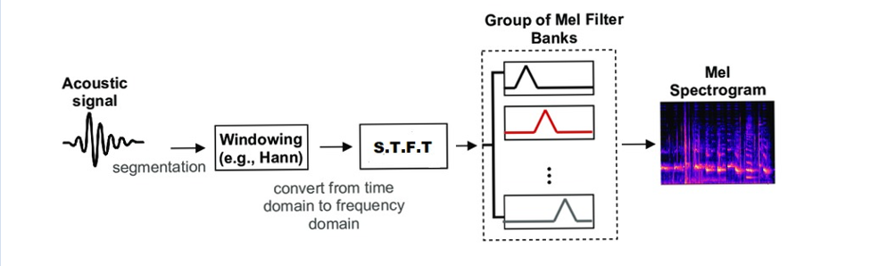
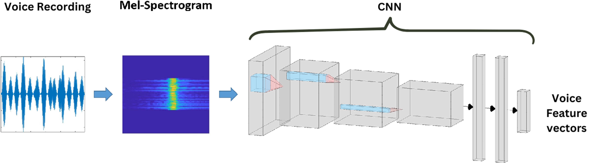
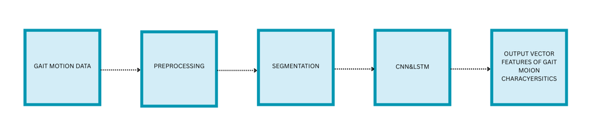
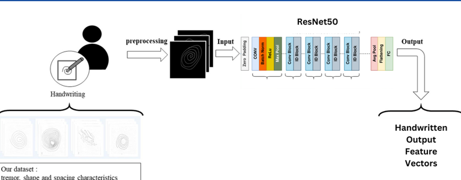

# 🧠 Multimodal Parkinson’s Disease Prediction

This project presents a **Multimodal Ensemble Learning Approach** for the **Prediction of Parkinson’s Disease (PD)** using **three physiological modalities**:  
- 🗣️ **Speech** recordings (audio)
- 🚶 **Gait** patterns (CSV time-series data)
- ✍️ **Handwriting** samples (spiral/wave images)

Our approach integrates **deep learning** and **traditional machine learning models**, achieving **state-of-the-art accuracy** through multimodal data fusion.

---

## 📁 Project Structure

```
Multimodal-Parkinson-Disease-Prediction/
├── Speech - Feature Extraction.ipynb       # Audio preprocessing & CNN modeling
├── Gait - Feature Extraction.ipynb       # Gait signal extraction & CNN-LSTM modeling
├── Handwriting - Feature Extraction.ipynb  # Image-based ResNet-50 handwriting analysis
├── Multimodal_Fusion_MLP.ipynb          # MLP and XGBoost trimodal fusion
├── AUDIO+GAIT - Bimodal.ipynb   # RF fusion models
├── AUDIO+HAND - Bimodal.ipynb   # RF fusion models
├── HAND+GAIT - Bimodal.ipynb   # RF fusion models
└── README.md                            # Project documentation
```

---

## 🧬 Datasets Used

### 🎙️ Voice Dataset  
- **Title**: Voice Samples for Parkinson's and Healthy Controls  
- **Source**: [Figshare Dataset](https://figshare.com/articles/dataset/Voice_Samples_for_Patients_with_Parkinson_s_Disease_and_Healthy_Controls/23849127)  
- **Details**:
  - `.wav` recordings of sustained vowel sounds (/a/)
  - Demographic metadata: Age, Sex, Label (HC/PwPD)

### 🚶 Gait Dataset  
- CSV format gait signal sequences or video frame silhouettes
- **Source**: [Figshare Dataset](https://figshare.com/articles/dataset/A_public_dataset_of_video_acceleration_and_angular_velocity_in_individuals_with_Parkinson_s_disease_during_the_turning-in-place_task/14984667)  
- **Preprocessing**:
  - Frame extraction → Silhouette detection → GEI creation  
  - Feature vectors: Joint positions, spatial-temporal stats

### ✍️ Handwriting Dataset  
- Spiral and wave drawings scanned as image files
- **Source**: [Kaggle Dataset](https://www.kaggle.com/datasets/kmader/parkinsons-drawings/data)  
- Feature focus: Tremors, jagged strokes, drawing irregularities

---

## ⚙️ Technologies & Libraries

- **Jupyter Notebook**, **Google Colab**
- 🧮 NumPy, Pandas, Matplotlib, Seaborn
- 🧠 TensorFlow, Keras, Scikit-learn, XGBoost
- 🎵 Librosa, Soundfile, SciPy (audio processing)
- 🖼️ OpenCV (image preprocessing)

---

## 🧪 Methodology Overview

### Speech Processing (CNN)
- Convert `.wav` → Mel spectrograms
- Feed into CNN → Detect jitter, shimmer, and PD vocal signs
<p align="center">
  
</p>
<p align="center">
  
</p>


### Gait Processing (CNN-LSTM)
- Signal → Silhouette extraction → GEI image or joint vector
- CNN extracts spatial features, LSTM captures temporal dynamics
<p align="center">
  
</p>

### Handwriting Analysis (ResNet-50)
- Spiral images passed into pretrained **ResNet-50**
- Detects tremors, irregular curves from spatial CNN filters
<p align="center">
  
</p>

### Multimodal Fusion Models

| Fusion | Model         | Description |
|--------|---------------|-------------|
| Bimodal | Random Forest | Combines speech+gait / handwriting+gait / speech+handwriting|
| Trimodal | MLP          | Dense NN to learn fused representations |
| Trimodal | XGBoost      | Boosted ensemble for structured feature learning |

---

## 📊 Performance Summary

| Model         | Modality        | Highlights |
|---------------|-----------------|------------|
| CNN           | Speech          | ⭐ Best unimodal |
| CNN-LSTM      | Gait            | Good sequence learning |
| ResNet-50     | Handwriting     | Effective tremor detection |
| RF / MLP / XGB| Multimodal Fusion | 🔥 Top overall accuracy |

> 💡 Bimodal fusion yielded the **highest diagnostic accuracy** using complementary features.

<p align="center">
  
</p>

## 📌 Key Insights

- **Multimodal fusion improves accuracy** over unimodal models
- **Audio features dominate**, but combining with gait/handwriting helps robustness
- **Ensemble models (MLP, XGBoost)** generalize well under noisy/incomplete inputs

---

## 🧠 Why This Project Matters

- ✅ **Non-invasive** and **scalable** diagnostic solution
- ✅ **Robust** to missing data or noise
- ✅ Ready for real-world applications in **telehealth** or **clinical** settings

---

## 📍 Conclusion

Our multimodal approach sets a new benchmark for Parkinson’s Disease prediction using speech, handwriting, and gait data. It demonstrates the value of **deep feature extraction**, **fusion modeling**, and **ensemble learning** in medical diagnostics.

---

## 👨‍💻 Authors

- 👤 Project by: `Vishal M`
