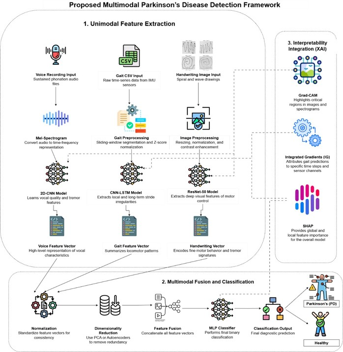

<!-- HEADER BANNER -->
<h1 align="center">🧠 Multimodal Parkinson’s Disease Prediction with XAI</h1>
<h3 align="center">Explainable AI Powered Healthcare Intelligence</h3>

  
  
  
  

---

A deep learning–based multimodal system for **early detection of Parkinson’s Disease** using **speech, gait, and handwriting biomarkers**, combined with Explainable AI (XAI) techniques for clinical interpretability.

---
## 🌟 Project Vision

> Early detection of Parkinson’s Disease using **AI-driven digital biomarkers**  
> that are **accurate, interpretable, and clinically reliable**.

This research introduces a **trimodal deep learning framework** that integrates:

🎤 Voice Biomarkers  
🚶 Gait Dynamics  
✍️ Handwriting Motor Patterns  

to create a **robust explainable diagnostic system**.

## 🚀 Project Highlights

- ✅ Multimodal Deep Learning Framework  
- ✅ Integrates **Speech + Gait + Handwriting**
- ✅ Uses Explainable AI (SHAP, Grad-CAM, Integrated Gradients)
- ✅ Robust against noisy or missing modality data
- ✅ Clinically interpretable predictions

---

## 📊 Performance

| Model | Accuracy |
|------|----------|
| Speech (EfficientNet-B0) | 74% |
| Gait (TCN + Autoencoder) | 90% |
| Handwriting (ResNet50) | 91% |
| **Trimodal Fusion (XGBoost)** | **92%** |

⭐ **Up to 18% improvement** over unimodal models.

---

## 🏗️ System Architecture

The framework consists of:

### 1️⃣ Speech Pipeline
- Log-Mel Spectrograms
- EfficientNet-B0 Feature Extraction
- Grad-CAM Explainability

### 2️⃣ Gait Pipeline
- Temporal Convolution Networks
- Autoencoder Embeddings
- SHAP + Integrated Gradients

### 3️⃣ Handwriting Pipeline
- Spiral Image Processing
- ResNet-50 CNN
- Grad-CAM Visualization

### 4️⃣ Multimodal Fusion
- Feature Concatenation
- XGBoost Classifier
- SHAP for Global Interpretability

---
### 🔍 Techniques Used

| Method | Purpose |
|--------|---------|
| SHAP | Global feature importance |
| Grad-CAM | Visual attention maps |
| Integrated Gradients | Temporal signal attribution |

This makes the system **clinically trustworthy**.

---

## 📂 Dataset Sources

- **Gait:** PhysioNet GAITPDB  
- **Speech:** MDVR-KCL Dataset  
- **Handwriting:** Kaggle Parkinson Handwriting Dataset  

---

## 📈 Results

- Trimodal model achieved:
  - **Accuracy:** 92%
  - **AUC:** 0.95
  - **Average Precision:** 0.96
- Demonstrated strong class separation in UMAP visualization.
- Explainability maps highlighted clinically relevant biomarkers.

---

## 🧩 Tech Stack

- Python
- PyTorch / TensorFlow
- Scikit-learn
- XGBoost
- OpenCV
- SHAP
- Grad-CAM

---

## 🎯 Applications

- Early Parkinson Screening
- Clinical Decision Support
- Remote Patient Monitoring
- Digital Biomarker Analysis

---

## 🏆 Publication Status

📌 This research is currently **published in Frontiers Journal**.

---

## 👨‍💻 Authors

- **M. Vishal**
- R. Abishek  
VIT Chennai — School of Computer Science & Engineering

---

## 📜 License

This project is for academic and research purposes.
